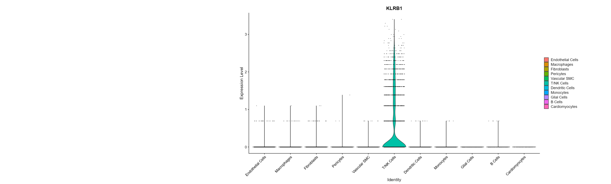

## Preprocessing Pipeline for Single-Cell RNA Sequencing

Preprocessing workflow for easy, automated visualization and marker exploration.

### Marker exploration:

* Though the example above uses a Seurat object with already-labeled clusters, the ability to easily view expression levels of markers visually and through a violin plot allows for easier cluster identification in unlabeled objects.

With the knowledge that the original dataset used above is from humans, running through the preprocessing pipeline and using the marker exploration allows for efficient cluster labeling. Filtering markers by cluster and then sorting by expression metrics, all the clusters were quickly labeled. This labeling reflects the generative labeling that the SingleR package produced when run on the same unlabeled object.

For example, in the pictures above, we can see that the marker KLRB1 in the T/NK cells cluster has a very high avg_log2FC (average log2 fold change) metric, which measures how much a gene's expression differs between one cluster and other clusters. We can also see, visually and statistically (pct.2 = 0.002%), that it is very lowly expressed in cells outside of this cluster. Thus, since KLRB1 is a known T and NK cell marker, it supports the theory that this cluster is a T/NK cell cluster. We can progress similarly through other clusters to identify what type of cells they represent.

### Preprocessing specifics

Before marker exploration, a preprocessing pipeline is built primarily with the Seurat package in R:

1. BPCells compression
   * Storing large count matrices (as in the above example, with 100000+ records in the raw counts) on local disk to cache operations and improve computational efficiency.
2. Quality control
   * Initial selection of "good", high-quality data using metrics for the number of unique genes detected in a cell, the number of individual RNA molecules detected in a cell, and the percentage of RNA counts that are mitochondrial.
3. Normalization and scaling
   * Adjusting for relative differences and standardizing, removing unwanted technical noise with SCTransform.
4. Doublet detection
   * Identifying bad reads using scDblFinder and classification methods to detect doublets, two cells accidentally read as one when sequencing.
5. Clustering
   * Performing linear dimensionality reduction (PCA) in preparation for nearest neighbors clustering.
   * Performing nonlinear dimensionality reduction (UMAP) for visualization.

### Datasets

The example above utilizes the Gene Expression Omnibus series [GSE217494](https://www.ncbi.nlm.nih.gov/geo/query/acc.cgi?acc=GSE217494) and the Human Primary Cell Atlas from SingleR.